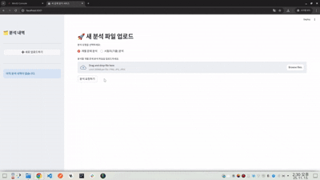
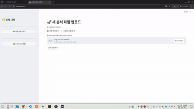
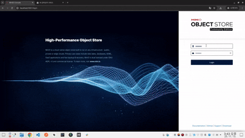
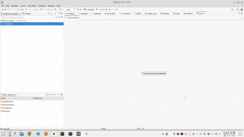
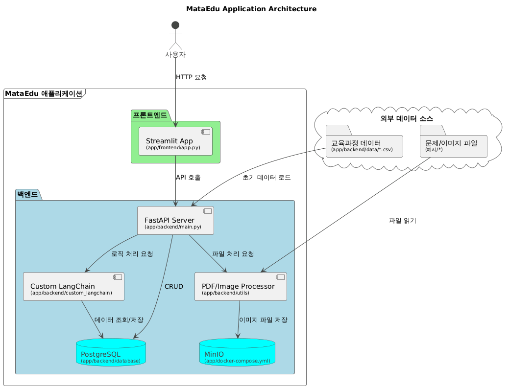
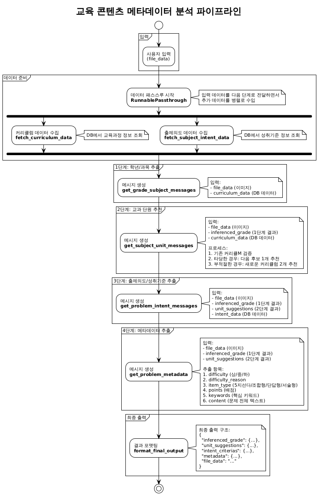

# README
최종산출물 파일과 동일합니다. 

# 실행 예시
개별 문항 이미지 파일을 업로드하면 분석 후 분석 결과를 보여줍니다. 

시험 문제 pdf 파일을 업로드하면 분석 후 분석 결과를 보여줍니다. 이 분석 결과는 시험 문제지 안에 있는 개별문항에 대한 기초 통계 및 개별 분석 결과의 개요에 해당합니다.
이때 이 문제지 안에 있는 개별 문항들의 각 크롭된 이미지들은 minio에서 확인하실 수 있습니다.

모든 메타 데이터 분석 결과 및 기타 메타 정보들은 postgres 데이터베이스에서 확인할 수 있습니다.

## 실행 방법

* 필요 문서 : 

env 파일을 backend/.env 경로에 넣어주세요.

git clone https://github.com/swchoi11/mataedu-poc.git

cd app
docker compose up --build

### 웹
* front : http://localhost:8501
* minio : http://localhost:9001
(minio 접속 아이디와 비밀번호는 환경변수 파일 안에 있습니다.)

## 아키텍처

## 파이프라인 흐름도

